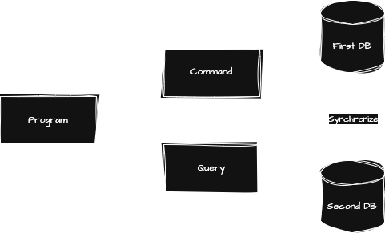

# ✔️ CleanArchEnablers.Framework.Cqrs
C# Microsoft.NET edition

<br>

Welcome to the repository for the open source CAE CQRS Framework!

### ▶️ The NuGet Package:
```xml
<ItemGroup>
    <PackageReference Include="CleanArchEnablers.Utils.Cqrs" Version="${LatestVersion}">
</ItemGroup>
```

<br>

State Symbol Key:

- ``✅`` — _Under release state_
- ``✔️`` — _Under snapshot state_
- ``⏳`` — _Under full development state_

<br>
<br>
<br>

## 📚 Key Concepts



### Command - Queries

Commands are the part who will create, update or delete data in your database. <br />
This is how we declare a Command:
```csharp
public class YourCommand : ICommand { }
```

Queries are the part who will only read your database. <br />
This is how we declare a Query:
```csharp
public class YourCommand : IQuery { }
```

We need these type because we use in Dispatchers and Handlers.

### Handlers

We have 2 types of handlers, CommandHandler and QueryHandler. 

The handlers are the implementation of our code, example:
```csharp
public class CreateUserCommandHandler(IUserRepository repository)
    : ICommandHandler<CreateUserCommand, CreateUserCommandResult>
{
    private readonly IUserRepository _repository = repository;

    public async Task<CreateUserCommandResult> Handle(CreateUserCommand command, CancellationToken cancellationToken)
    {
        var user = UserDomainEntityFactory.CreateInstance(command.Email, command.Password);
        var result = await _repository.CreateUserAsync(user);

        return new CreateUserCommandResult(result);
    }
}
```

### Dispatchers

The dispatcher will be our bridge between the controllers and commands/queries. He will send a signal to run the implementations.

Example:
```csharp
[ApiController]
[Route("/api/")]
public class UserController(IQueryDispatcher queryDispatcher)
    : ControllerBase
{
    [HttpGet("v1/user")]
    public async Task<IActionResult> FetchUsers(CancellationToken cancellationToken)
    {
        var query = new FetchUsersQuery();
        var users = await _queryDispatcher.Dispatch<FetchUsersQuery, FetchUsersQueryResult>(query, cancellationToken);

        return Ok(users);
    }
}
```

## ⚠️ Attention

- To use `Cae.Cqrs`, you need to add on your IServiceCollection.

```csharp
builder.Services.AddCaeCqrs(Assembly.GetExecutingAssembly());
```

- `CarCqrs` injects automatically any object implementing `IQueryHandler<,>` or `ICommandHandler<,>`

## 🌐 Other components of the SDK:

- ``✔️`` [CleanArchEnablers.Utils.MappedExceptions](https://github.com/clean-arch-enablers-project/CleanArchEnablers.Utils.MappedExceptions)
- ``✔️`` [CleanArchEnablers.Utils.Trier](https://github.com/clean-arch-enablers-project/CleanArchEnablers.Utils.Trier)

<br>
<br>
<br>

<p align="center">
    CAE — Clean Architecture made easy.
</p>
